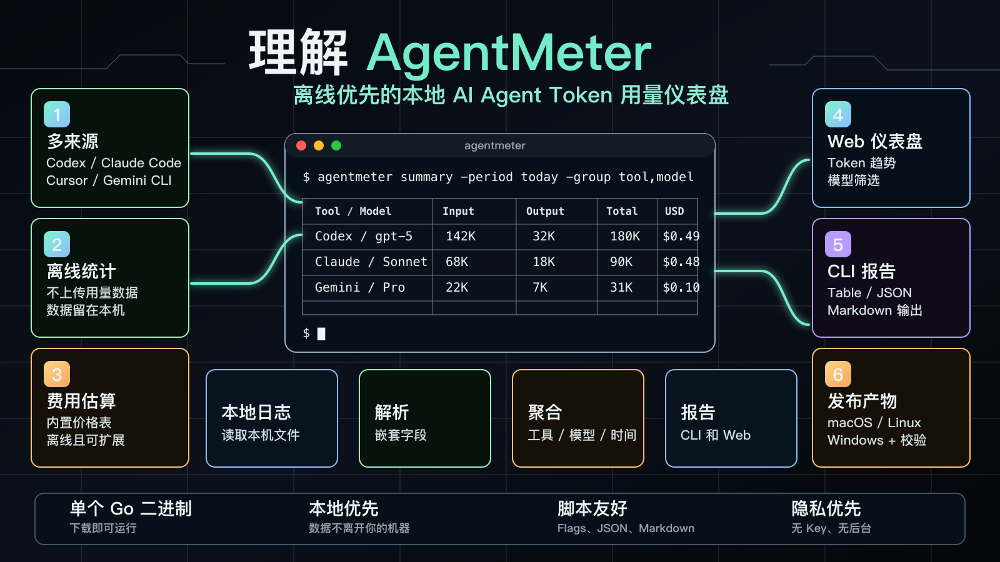
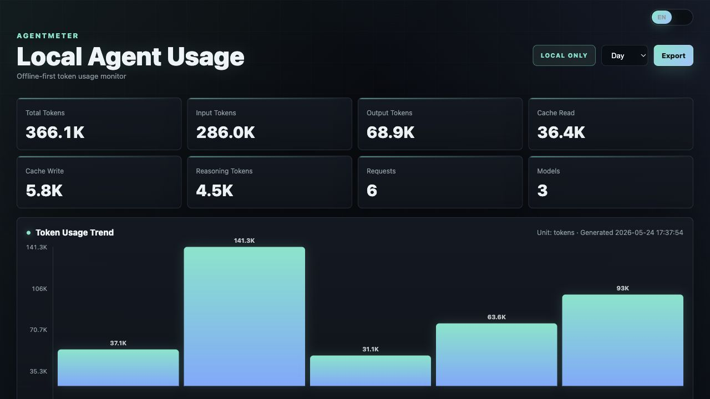

# AgentMeter



[English](README.md)

AgentMeter 是一个离线优先的本地 AI Agent 用量统计工具。它读取本机日志，汇总 token 用量，估算费用，并同时提供适合脚本调用的 CLI 和内置 Web 仪表盘。

它不会上传用量数据，不读取 API Key，也不依赖后台服务。所有统计都在本机完成。



## 功能特性

- 统计 Codex、Claude Code、Cursor、Gemini CLI 以及通用 JSON/JSONL 日志。
- CLI 支持 `table`、`json`、`markdown` 输出。
- 内置 Web 仪表盘，展示 token 趋势、每日 API 请求次数、排行和模型明细。
- Web 支持深色/白色主题、中英文切换，以及友好/原始 token 数量切换。
- 拆分展示 input、output、cache read、cache write、reasoning、tool tokens。
- 模型用量明细按 `日期 + 工具 + 模型` 聚合。
- 基于内置离线模型价格表估算 USD 成本。
- Web 仪表盘支持 CSV 导出。
- 不需要后端服务、账号接入或遥测上传。

## 快速开始

使用示例数据启动 Web 仪表盘：

```bash
cd agentmeter
go run . serve -paths examples
```

然后打开：

```text
http://127.0.0.1:8787
```

运行 CLI 摘要：

```bash
cd agentmeter
go run . summary -period all -group model -paths examples
```

> 说明：如果你的本地 Go 环境有自定义 `GOROOT` 或缓存策略，可以在运行示例前自行设置相关环境变量。

## 安装

从 GitHub Releases 下载对应系统的压缩包，解压后运行 `agentmeter` 二进制文件。

macOS/Linux：

```bash
tar -xzf agentmeter_VERSION_OS_ARCH.tar.gz
./agentmeter serve -paths examples
```

Windows PowerShell：

```powershell
Expand-Archive .\agentmeter_VERSION_windows_amd64.zip
.\agentmeter_VERSION_windows_amd64\agentmeter.exe summary -period all -paths examples
```

通过 Go 从源码目录安装：

```bash
git clone https://github.com/why19970628/agentmeter.git
cd agentmeter
go install .
```

查看命令帮助：

```bash
agentmeter summary -help
agentmeter serve -help
agentmeter scan -help
```

## CLI 用法

按工具汇总：

```bash
go run . summary -period month -paths ~/.codex,~/.claude
```

显式按工具汇总：

```bash
go run . summary -period month -group tool -paths ~/.codex,~/.claude
```

按模型汇总：

```bash
go run . summary -period all -group model -paths ~/.codex,~/.claude,~/.gemini
```

按工具 + 模型汇总：

```bash
go run . summary -period all -group tool -group model -paths ~/.codex,~/.claude
```

也支持合并写法：

```bash
go run . summary -period all -group tool,model -paths examples
```

面向脚本的 JSON 输出：

```bash
go run . summary -period week -format json -paths ~/.codex
```

中文 CLI 表头：

```bash
go run . summary -period all -group model -lang zh-CN -paths examples
```

Markdown 输出：

```bash
go run . summary -period month -format markdown -group model -paths examples
```

只扫描并输出摘要：

```bash
go run . scan -paths examples
```

启动 Web 仪表盘：

```bash
go run . serve -addr 127.0.0.1:8787 -paths ~/.codex,~/.claude,~/.cursor,~/.gemini
```

## 时间范围

当前支持：

- `today`
- `week`
- `month`
- `all`

## 输出格式

CLI 支持：

- `table`
- `json`
- `markdown`

表格输出示例：

```text
Model            Input Tokens  Output Tokens  Cache Read  Cache Write  Reasoning  Tool Tokens  Total Tokens  Est. USD
gpt-5            142,612       32,110         8,100       1,600        3,420      900          180,642       $0.499
claude-sonnet-4  121,000       29,200         23,100      4,200        0          0            154,400       $0.801
Total            263,612       61,310         31,200      5,800        3,420      900          335,042       $1.300
```

## Web 仪表盘

Web 仪表盘用于本地查看：

- 总 tokens、输入/输出 tokens、缓存 tokens、推理 tokens、请求数、模型数。
- Token 用量趋势，并展示每日简化用量。
- 每日 API 请求次数折线图，并在每日点位显示请求数。
- 工具排行和项目排行；项目排行只显示项目名，项目较多时可滚动查看。
- 按 `日期 + 工具 + 模型` 聚合的模型用量明细。
- 顶部控制区支持深色/白色主题切换，以及友好/原始 token 数量切换，默认展示友好数量。
- CSV 导出。
- Web 默认英文，可点击按钮在中文/英文之间切换，也支持 `?lang=zh-CN` 或 `?lang=en`。

## 数据来源

默认会检查常见本地 agent 目录：

```text
~/.codex
~/.claude
~/.cursor
~/.gemini
```

也可以显式指定路径：

```bash
go run . summary -paths ~/.codex,~/logs/agent-usage
```

AgentMeter 会递归读取：

- `.json`
- `.jsonl`
- `.log`

## 支持的用量字段

AgentMeter 支持扁平和嵌套的 usage 结构，例如：

```json
{
  "tool": "codex",
  "model": "gpt-5",
  "session_id": "s1",
  "project": "/path/to/project",
  "usage": {
    "input_tokens": 120,
    "output_tokens": 30,
    "cache_read_input_tokens": 20,
    "cache_creation_input_tokens": 10,
    "reasoning_tokens": 5,
    "tool_tokens": 2
  },
  "timestamp": "2026-05-03T10:00:00Z"
}
```

也支持一些常见厂商字段结构：

```json
{
  "usage": {
    "input_tokens_details": {
      "cached_tokens": 15
    },
    "output_tokens_details": {
      "reasoning_tokens": 12
    },
    "cache_creation": {
      "ephemeral_5m_input_tokens": 6,
      "ephemeral_1h_input_tokens": 4
    }
  }
}
```

模型和项目字段会从常见别名中解析，例如 `model_id`、`modelId`、`model_slug`、`workspace_path`、`current_working_directory`、`root_path`。AgentMeter 也会根据同一日志文件中的 `session_id` 上下文，把前后出现的模型/项目信息补到用量记录上。

## 费用估算

`Est. USD` 表示预估美元费用。它基于 token 数和内置模型价格表离线计算。

它不是官方账单。如果某个模型没有匹配到价格，费用可能显示为 `0`。

## 隐私

AgentMeter 是本地优先工具：

- 不上传用量数据。
- 不读取 API Key。
- 不连接账号。
- 不依赖远程后台。

它只读取你传入的路径，或默认的本地 agent 日志目录。

## 开发

运行测试：

```bash
cd agentmeter
go test ./...
```

使用示例数据启动：

```bash
go run . serve -paths examples
```

## 发布

推送 `v*` tag 后，GitHub Actions 会通过 GoReleaser 构建 GitHub Release。Release assets 会包含 macOS、Linux、Windows 压缩包和 `checksums.txt`。

创建 release：

```bash
git tag v0.1.0
git push origin v0.1.0
```

本地构建 release snapshot：

```bash
make release-snapshot
```

版本历史见 [CHANGELOG.md](CHANGELOG.md)。

## 许可证

AgentMeter 使用 [MIT License](LICENSE) 发布。

## 项目状态

AgentMeter 目前是一个早期本地工具。当前重点是可靠解析本地日志、提供清晰的用量摘要和轻量 Web 仪表盘。后续可以继续增强数据源诊断、自定义价格、会话视图和 provider 归属等能力。
